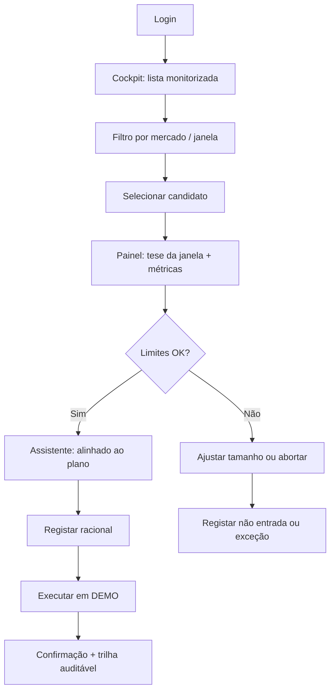
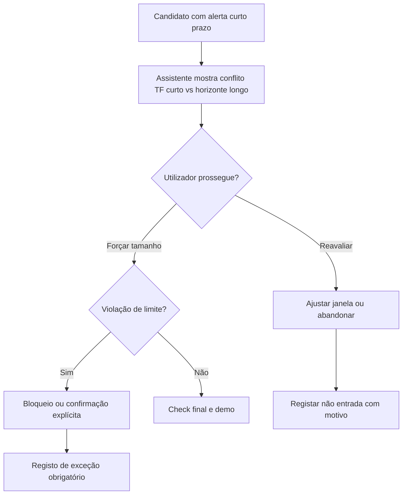
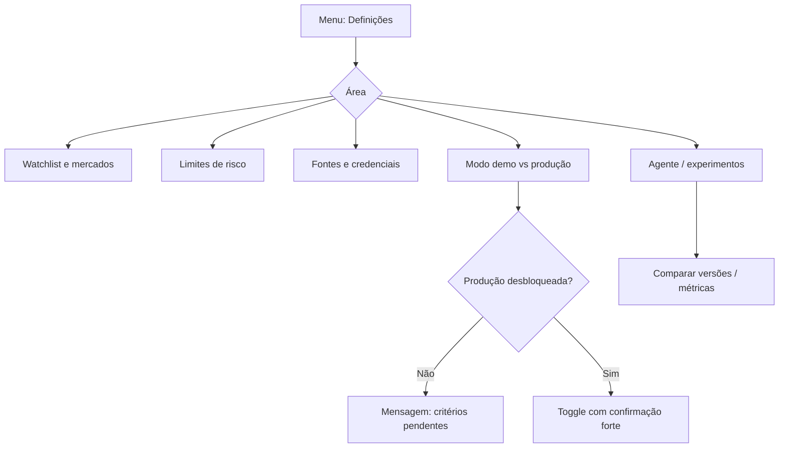
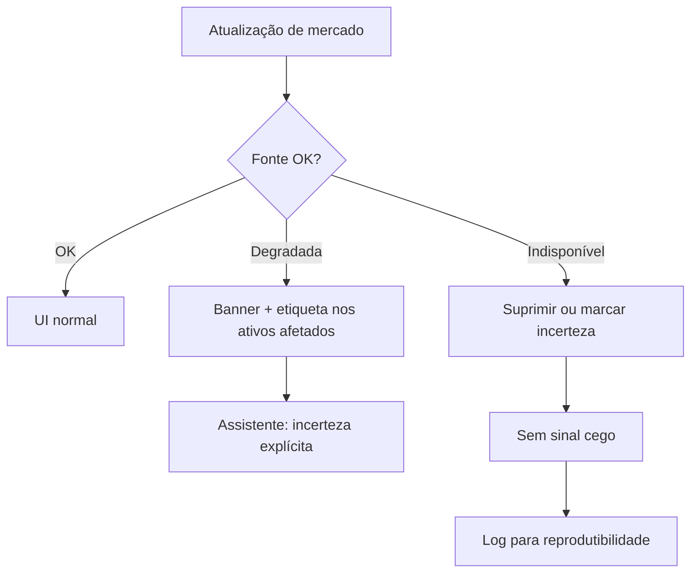

---
stepsCompleted:
  - 1
  - 2
  - 3
  - 4
  - 5
  - 6
  - 7
  - 8
  - 9
  - 10
  - 11
  - 12
  - 13
  - 14
lastStep: 14
inputDocuments:
  - _bmad-output/planning-artifacts/prd.md
  - _bmad-output/planning-artifacts/product-brief-tradesystem.md
uxCompletedAt: "2026-04-05"
---

# Especificação de UX — tradesystem

**Autor:** Eder  
**Data:** 2026-04-05

---

## Resumo executivo (UX)

### Visão do projeto

O **tradesystem** é um **cockpit web** pessoal para apoio à decisão e à execução em mercados de capitais. Do ponto de vista de UX, o produto deve reduzir **fadiga decisória** e **inconsistência plano–execução**, tornando **timeframe + horizonte (dia / semana / mês)** o eixo visível de cada oportunidade e de cada decisão. O valor percecionado não é “sinal milagroso”, mas **clareza, disciplina, risco explícito e trilha auditável**, com **demo primeiro** e linguagem que reforça **incerteza** e responsabilidade do operador.

### Utilizadores-alvo

- **Utilizador primário:** Eder — investigação e operação **individual**, competência técnica **intermédia**, sessões **longas em desktop** durante o mercado.
- **Contexto de uso:** manhã/pré-abertura e intradiário; foco **B3 e EUA**; possível consulta rápida em tablet/mobile para resumo e alertas críticos (MVP: secundário).

### Principais desafios de design

1. **Densidade informacional vs. clareza:** muitos ativos, candidatos, estados de dados e métricas sem sobrecarregar o utilizador.
2. **Coerência de janela:** tornar óbvia a ligação **oportunidade ↔ timeframe ↔ horizonte** e tornar **conflitos entre janelas** impossíveis de ignorar quando relevantes.
3. **Confiança sem falsa segurança:** assistente e agente úteis, mas com **copy e padrões visuais** que evitem sensação de garantia de retorno.
4. **Fluxos de risco e bloqueio:** bloqueios e confirmações de exceção devem ser **compreensíveis num segundo**, com caminho claro para registar racional.
5. **Estado em tempo quase real:** atualizações frequentes sem congelar a UI; **degradação visível** quando fontes falham.

### Oportunidades de design

- **Cockpit único** que fecha o loop **oportunidade → janela → risco → decisão → registo**, alinhado às jornadas do PRD.
- **Assistente contextual** como “espelho” do plano e dos limites, não como oráculo.
- **Padrões de auditoria** na interface (o que foi decidido, em que janela, porquê) como reforço emocional de controlo e melhoria contínua.

---

## Experiência central do utilizador

### Definição da experiência

O loop mais frequente é: **abrir o cockpit → rever candidatos por ativo/janela → aprofundar um candidato → ver checks de risco e parecer do assistente → registar decisão (operar / não operar / exceção) em demo**, com a **janela de operação** sempre explícita no percurso.

### Estratégia de plataforma

- **Web SPA** autenticada, **desktop-first**; canal em tempo quase real (WebSocket ou SSE) para ticks, candidatos e estado de fontes.
- **Browsers (MVP):** duas últimas versões de Chrome, Edge, Firefox e Safari (desktop).
- **Tablet/mobile:** layouts legíveis para lista, alertas e bloqueios; funções densas (gráficos, experimentos) podem ficar desktop-first no MVP.

### Interações que devem ser effortless

- Filtrar e ordenar candidatos por **timeframe** e **horizonte**.
- Ver **de relance** se um candidato está alinhado, em conflito ou com dados **degradados/indisponíveis**.
- Registar **racional estruturado** em poucos passos após uma decisão.
- Identificar **modo demo vs. produção** em qualquer ecrã de execução.

### Momentos críticos de sucesso

- **“Percebo a tese desta janela em menos de um minuto.”** (assistente + resumo visual)
- **“O sistema impediu-me de violar um limite e eu entendi porquê.”**
- **“Quando os dados falharam, vi o estado da fonte — não fiquei a operar às cegas.”**

### Princípios de experiência

1. **Janela primeiro:** toda oportunidade relevante mostra **timeframe + horizonte** antes do detalhe técnico profundo.
2. **Risco no fluxo, não à parte:** checks de limite aparecem **antes** da ação de execução ou registo final.
3. **Transparência > brilhantismo:** preferir explicações claras a animações que distraem.
4. **Nunca congelar:** trabalho pesado em segundo plano; a UI mantém-se responsiva (alinhado aos NFRs).

---

## Resposta emocional desejada

### Objetivos emocionais principários

- **Controlo e foco** (vs. sobrecarga de ecrãs soltos).
- **Confiança processual** — confiança no **processo e na disciplina**, não na promessa de lucro.
- **Alívio cognitivo** ao ter conflitos e riscos **nomeados** pelo assistente.

### Mapa emocional da jornada

| Fase | Estado desejado |
|------|------------------|
| Entrada na sessão | Orientação — “sei o que está em jogo hoje” |
| Exploração de candidatos | Curiosidade focada, não ansiedade |
| Conflito de janelas / bloqueio | Respeito pela proteção — clareza, não humilhação |
| Pós-decisão | Encerramento — decisão explicável e registada |
| Falha de dados | Alerta calmo, informação acionável |

### Micro-emotions

- Priorizar **confiança** e **clareza** sobre “excitação de trading”.
- Evitar **vergonha** ou **jargão acusatório** em bloqueios de risco; usar tom **neutro e factual**.
- **Satisfação discreta** ao cumprir plano / registar bem o racional.

### Implicações de design

- **Hierarquia visual** que destaque **estado** (OK / conflito / degradado) antes de P&L ou “força do sinal”.
- **Copy** consistente com **incerteza** e decisão do utilizador (FR32).
- **Confirmações de exceção** com texto curto + link “saber mais” para detalhe.

### Princípios de design emocional

1. **Seriedade financeira sem alarmismo.**
2. **O sistema trabalha para ti, não contra ti** — bloqueios são explicados como guarda-raios.
3. **Honestidade sobre o que o modelo/agente não sabe.**

---

## Análise de padrões UX e inspiração

### Produtos e referências analisados

| Referência | O que extrair para o tradesystem |
|------------|----------------------------------|
| **Terminais e cockpits profissionais** (Bloomberg-like, mas simplificado) | Densidade controlada, hierarquia de colunas, cor semântica para estado. |
| **Linear / ferramentas de produto “calmas”** | Tipografia clara, foco em uma tarefa principal, redução de ruído visual. |
| **Notion / painéis estruturados** | Blocos para “tese da janela”, racional e histórico com boa escaneabilidade. |
| **Assistentes contextuais (Copilot-style)** | Painel lateral ou secção dedicada, sempre ligado ao **contexto selecionado** (ativo + janela). |

*(Referências conceituais — não implica reutilização de marca ou UI específica.)*

### Padrões transferíveis

- **Navegação:** shell persistente com áreas **Cockpit**, **Candidato**, **Risco**, **Assistente**, **Definições**, **Histórico/Métricas**.
- **Interação:** **master–detail** (lista de ativos ou candidatos → painel de detalhe); filtros persistentes na sessão.
- **Visual:** tema **escuro opcional** para sessões longas; sempre com **contraste AA** nos fluxos críticos.

### Anti-padrões a evitar

- Lista plana de alertas **sem** timeframe/horizonte.
- **Caixa-preta:** scores ou recomendações sem caminho para “porquê” e “em que janela”.
- **Modais empilhados** para cada micro-decisão.
- Ocultar falhas de dados ou atrasos.

### Estratégia de inspiração

- **Adotar:** master–detail, semântica de cor para estado de mercado/dados, assistente acoplado ao contexto.
- **Adaptar:** densidade de terminal para **um único utilizador** e MVP mais enxuto.
- **Evitar:** gamificação agressiva ou linguagem de “ganho garantido”.

---

## Fundação do design system

### Escolha do design system

**Sistema tematizável sobre base sólida:** por exemplo **shadcn/ui + Tailwind CSS** (componentes acessíveis, tokens via CSS variables) **ou** **MUI** com tema customizado — priorizar **velocidade de MVP**, **WCAG AA** nos fluxos críticos e **flexibilidade** para componentes densos (tabelas, *badges*, estados).

### Racional

- Projeto **greenfield** com equipa reduzida: reutilizar **DataGrid**, formulários, diálogos e *toast* maduros.
- **Fintech pessoal:** foco em **contraste**, estados de erro/aviso e formulários de risco bem suportados.
- Alinhado ao PRD: **SPA**, *code splitting* para módulos pesados (gráficos).

### Abordagem de implementação

- Importar componentes base do design system; **tokens** (cor, espaço, raio, tipografia) centralizados.
- Componentes de domínio (ex.: **Cartão de candidato**, **Chip de janela**, **Barra de modo demo/produção**) construídos **por cima** dos primitivos.

### Estratégia de customização

- Tema **escuro “cockpit”** como padrão recomendado; tema claro disponível.
- **Semântica:** cores para *gain/loss* nunca como único indicador (sempre texto ou ícone acessório).
- Tipografia: uma família **UI** legível + eventual **monoespaçada** para preços/códigos.

---

## 2. Experiência central do utilizador (definição aprofundada)

### 2.1 Experiência definidora

**“Escolher uma oportunidade na janela certa e fechar o ciclo com risco e racional explícitos.”**  
Se isto funcionar bem, o resto (configurações, experimentos, relatórios) organiza-se à volta deste núcleo.

### 2.2 Modelo mental do utilizador

- O utilizador chega com mental model de **gráficos, timeframes e narrativa de trade**; o produto deve **espelhar** isso com **rótulos explícitos** (ex.: M15 + horizonte *dia*), não forçar jargão interno.
- Espera que **limites** sejam aplicados de forma previsível; surpresas devem ser **explicadas**, não apenas “erro genérico”.

### 2.3 Critérios de sucesso

- Abrir um candidato e responder: **qual janela?, qual risco?, alinhado ou conflituoso?, posso operar em demo?** sem sair do fluxo principal.
- Tempo de interação percecionado **< 200 ms** para ações com dados já em *cache* (requisito do PRD).

### 2.4 Padrões novos vs. estabelecidos

- **Combinar padrões estabelecidos** (dashboard, master–detail, painel de assistente) com **diferenciação conceitual**: **conflito entre janelas** como entidade de UI (ex.: *banner* ou secção “Conflito” com duas colunas curto vs. longo prazo).

### 2.5 Mecânica da experiência

1. **Início:** login → cockpit com último contexto (filtros, ativo selecionado) quando possível.
2. **Interação:** seleção de candidato → painel com abas ou secções **Resumo | Janela | Risco | Assistente | Execução/Registo**.
3. **Feedback:** estados em tempo real; *toasts* para eventos de sistema; *banner* persistente para **fonte degradada**.
4. **Conclusão:** confirmação de decisão com **snapshot** da janela e limite; entrada no histórico auditável.

---

## Fundação visual

### Sistema de cor

- **Fundo:** cinza-azulado muito escuro (`#0f1419` aprox.) ou equivalente tokenizado.
- **Superfície:** elevação por luminosidade/borda, não sombras pesadas.
- **Acento primário:** azul-teal ou âmbar contido — **uma** família de acento para ações principais.
- **Semântica:** sucesso/aviso/erro/informação alinhados a tokens; **conflito de janela** pode usar **cor de aviso** dedicada (ex.: âmbar) distinta de “erro de sistema”.
- **Contraste:** texto normal ≥ **4.5:1**; componentes interativos testados em ambos os temas.

### Tipografia

- **UI:** sans humanista ou neo-grotesque (ex.: **Source Sans 3**, **IBM Plex Sans**) — excelente legibilidade em densidade média-alta.
- **Dados:** **IBM Plex Mono** ou **JetBrains Mono** para preços, percentagens e timestamps.
- Escala modular (ex.: base **14–15px** desktop, escala **1.125** ou **1.2** para títulos).

### Espaçamento e layout

- Base **4 px**; ritmo **8 / 12 / 16 / 24 / 32** para secções.
- **Grelha:** 12 colunas em desktop; **zona fixa** para navegação lateral (240–280 px) ou topo compacto consoante a direção escolhida.
- Cockpit: **mínimo 1280 px** de largura alvo para experiência completa; abaixo disso, colapsar para coluna única com prioridade na lista.

### Acessibilidade (fundação)

- Modo de foco visível em todos os controlos custom.
- Não depender só de cor para estado (ícone + texto).
- Suporte a **prefers-reduced-motion** para animações não essenciais.

---

## Decisão de direção visual

### Direções exploradas

Foram definidas **seis** direções no ficheiro interativo `ux-design-directions.html` (cockpit denso, editorial claro, três colunas, foco único, alto contraste, minimal dashboard).

### Direção recomendada (MVP)

**Direção 3 — “Cockpit em três colunas”:** **Lista (ativos/candidatos) | Detalhe da janela + risco | Assistente + ações** — maximiza alinhamento com as jornadas 1–2 do PRD e com o fluxo **oportunidade → risco → decisão**.

### Racional

- Mantém **contexto** (lista) enquanto se lê tese e risco.
- O assistente permanece **visível** sem cobrir o detalhe (vs. só modal).
- Escalável para **estado de fonte** e *banners* de conflito sem quebrar o layout.

### Implementação

- Prototipar primeiro esta direção em wireframes de baixa fidelidade; usar o HTML de direções para **debate de tokens** (cor de acento, densidade).

---

## Fluxos de jornada do utilizador

### Jornada A — Manhã de mercado (percurso feliz)

Utilizador abre o cockpit, vê candidatos por ativo com **timeframe + horizonte**, seleciona um candidato alinhado ao plano, passa por **check de risco**, regista racional e executa em **demo**.

### Jornada B — Conflito de janelas e bloqueio de risco

Alerta de curto prazo com tendência semanal desfavorável; assistente **explicita conflito**; tentativa de violar limite → **bloqueio ou confirmação com exceção**.

### Jornada C — Operador: configuração e pós-trade

Acesso a definições (watchlist, limites, fontes, modo), revisão de métricas e experimentos; **gates demo → produção** visíveis.

### Jornada D — Falha ou degradação de dados

Fonte atrasada ou indisponível; UI mostra estado; sistema **não** apresenta candidatos como certos ou suprime com mensagem clara.

### Padrões de jornada

- **Entrada consistente** pelo cockpit; definições sempre acessíveis mas sem roubar foco.
- **Decisão binária clara** ao fim dos fluxos críticos: operar / não operar / exceção documentada.
- **Recuperação:** sempre explicar **causa** (dados vs. risco vs. modo) e **próximo passo**.

### Princípios de otimização de fluxo

1. **Menos cliques entre “vi o candidato” e “entiendo o risco”.**
2. **Progressive disclosure:** detalhe técnico do agente sob expansão.
3. **Nunca perder a janela** ao navegar entre passos.

---

## Estratégia de componentes

### Componentes do design system (base)

Botões, inputs, *select*, *checkbox*, *tabs*, *dialog*, *sheet/drawer*, *toast*, *tooltip*, *table/data grid*, *badge*, *card*, navegação lateral, *empty states*, *skeleton*.

### Componentes custom (domínio)

#### Cartão de candidato

- **Propósito:** resumo de uma oportunidade com **timeframe**, **horizonte**, força/confiança e estado de dados.
- **Estados:** normal, hover, selecionado, degradado, desabilitado (dados inválidos).
- **Acessibilidade:** `aria-label` com ativo + janela + estado; focável por teclado.

#### Chip de janela de operação

- **Propósito:** mostrar e filtrar por **TF + horizonte** de forma compacta.
- **Variantes:** alinhado, neutro, conflito.

#### Painel de conflito entre janelas

- **Propósito:** comparar narrativa **curto prazo** vs. **horizonte longo** lado a lado.
- **Conteúdo:** bullets curtos + nível de severidade.

#### Barra de modo (demo / produção)

- **Propósito:** **sempre visível** em áreas de execução; produção com estilo distinto e confirmação em dois passos.

#### Indicador de saúde da fonte

- **Propósito:** ponto ou ícone + texto “Operacional / Degradada / Indisponível” por fonte ou ativo.

#### Formulário de racional de decisão

- **Propósito:** estrutura fixa (motivo, tags opcionais, nota livre breve) para auditoria (FR20).

### Estratégia de implementação

- Tokens do tema para todos os custom; testes de **teclado** e **leitor de ecrã** nos componentes de decisão e risco.

### Roadmap de implementação

| Fase | Componentes |
|------|-------------|
| **1 — MVP núcleo** | Cartão candidato, chip janela, barra modo demo, formulário racional, indicador fonte |
| **2** | Painel conflito, visualizações de métricas, grelha de experimentos |
| **3** | Relatórios avançados, mobile expandido |

---

## Padrões de consistência UX

### Hierarquia de botões

- **Primário:** uma ação que avança o fluxo (ex.: “Registar decisão”, “Confirmar em demo”).
- **Secundário:** alternativas seguras (ex.: “Ajustar tamanho”).
- **Terciário / *ghost*:** cancelar, fechar, “ver detalhe técnico”.
- **Destrutivo:** apenas para ações irreversíveis (ex.: remover ativo da watchlist) com confirmação.

### Padrões de feedback

- **Sucesso:** *toast* curto + atualização do histórico.
- **Aviso:** *banner* ou *inline* para conflito de janela ou limite aproximado.
- **Erro:** mensagem específica + *correlation id* (FR36) copiável em definições ou modal de diagnóstico.
- **Info:** estado de dados e modo demo explicados sem bloquear.

### Formulários

- Labels sempre visíveis; erros ligados ao campo; **valores de risco** com unidade e exemplo.
- Validação **on submit** para fluxos críticos + *inline* onde reduz erros (ex.: número negativo).

### Navegação

- **Cockpit** como *home* pós-login; *breadcrumb* opcional em definições profundas.
- Atalhos de teclado documentados (futuro): `?` para ajuda.

### Padrões adicionais

- ***Skeleton* em listas** durante refreshes; não *spinners* fullscreen excepto primeira carga.
- ***Empty states*** com próxima ação (“Adicionar ativo”, “Configurar fonte”).
- **Modais:** máximo um nível; preferir *drawer* em viewport estreita.

---

## Design responsivo e acessibilidade

### Estratégia responsiva

- **Desktop (≥ 1024 px):** layout de cockpit completo (três colunas ou equivalente com *split* ajustável).
- **Tablet (768–1023 px):** duas colunas; assistente em *drawer*.
- **Mobile (&lt; 768 px):** coluna única; prioridade **lista + alertas + bloqueio de risco**; gráficos e experimentos podem ser “ver no desktop”.

### Breakpoints

- **sm** 640, **md** 768, **lg** 1024, **xl** 1280 (ajustável ao *grid* do design system).

### Acessibilidade

- **Alvo:** **WCAG 2.1 nível AA** nos fluxos críticos (login, navegação principal, risco, decisão), conforme PRD.
- Foco visível; ordem de tab lógica; *skip link* para conteúdo principal.
- **Touch targets** ≥ **44×44 px** onde aplicável.

### Estratégia de testes

- *Lighthouse* / axe em CI para regressões grosseiras; testes manuais com **teclado** e **VoiceOver/NVDA** nos fluxos de decisão.
- Testes e2e nos cenários das jornadas (feliz, conflito, falha de dados).

### Diretrizes de implementação

- HTML semântico; *roles* ARIA só quando o primitivo não chega.
- **Live regions** moderadas para atualizações de preço (evitar *spam* ao leitor de ecrã — agregar ou preferir atualização sob pedido).

---

*Documento gerado pelo fluxo BMAD Create UX Design, alinhado ao PRD e ao product brief do tradesystem.*
